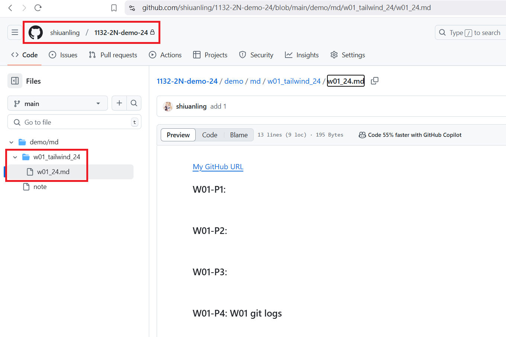
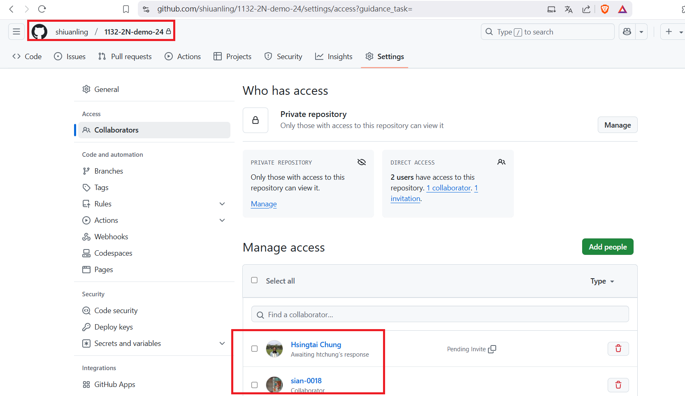
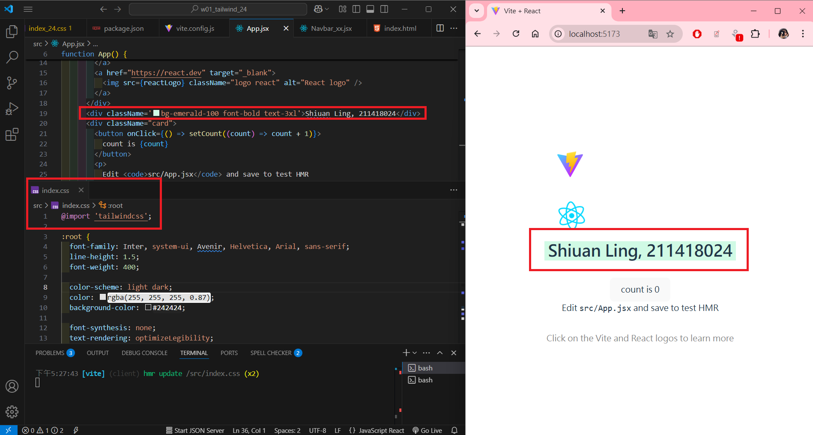
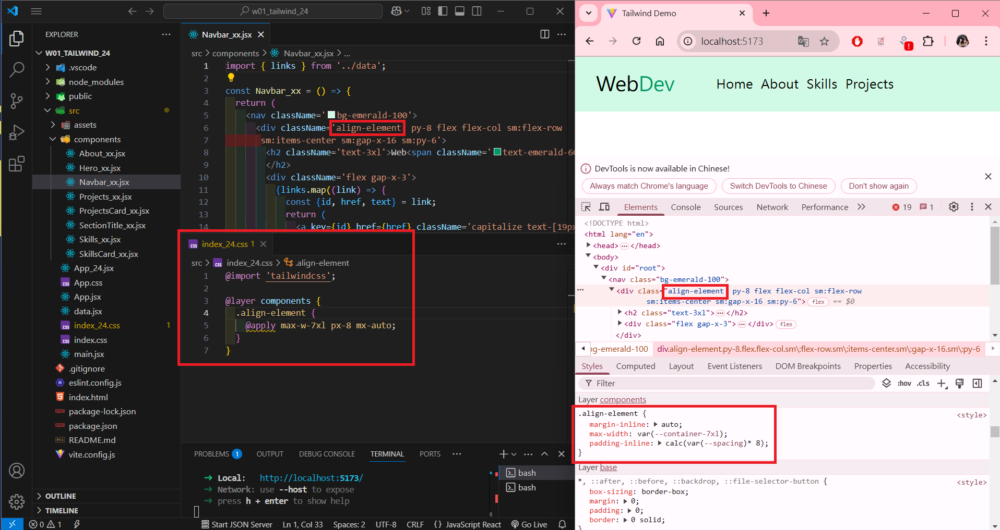
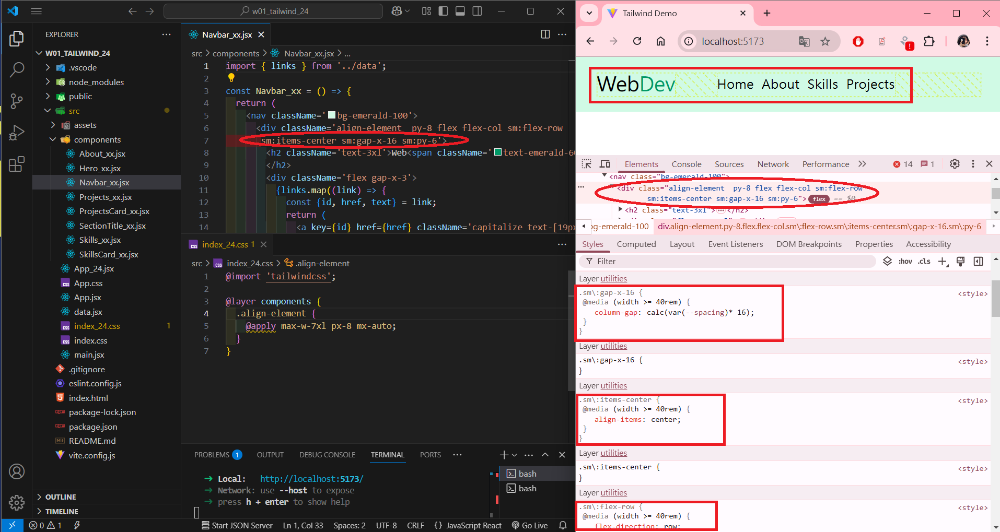
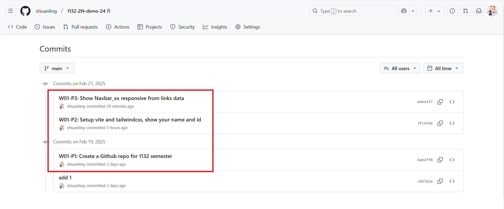

[My GitHub URL](https://github.com/shiuanling/1132-2N-demo-24.git)

### W01-P1: Create a Github repo for 1132 semester
 
#### => Github repo
 

 
#### => share to teacher and TA
 

```
dab2ff8 shiuanling      Wed Feb 19 19:01:10 2025 +0800  W01-P1: Create a Github repo for 1132 semester
```

### W01-P2: Setup vite and tailwindcss, show your name and id


### W01-P3: Show Navbar_xx responsive from links data
 
#### => for screen size < 640px
 

 
#### => for screen size > 640px (small)
 


### W01-P4: W01 git logs


git log --pretty=format:"%h%x09%an%x09%ad%x09%s" --after="2024-02-18"