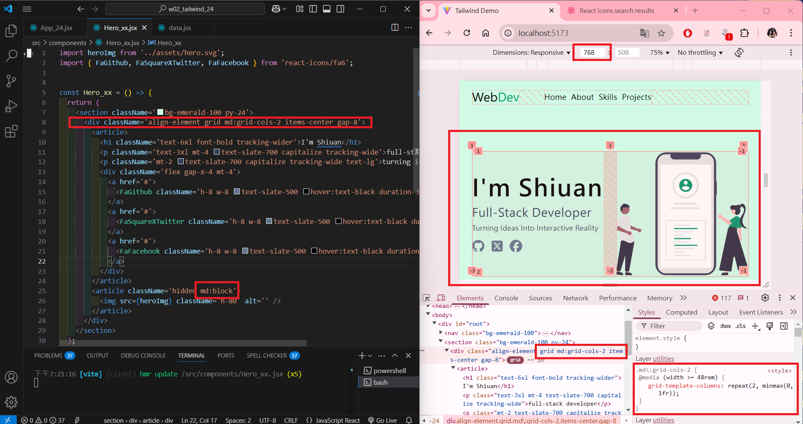
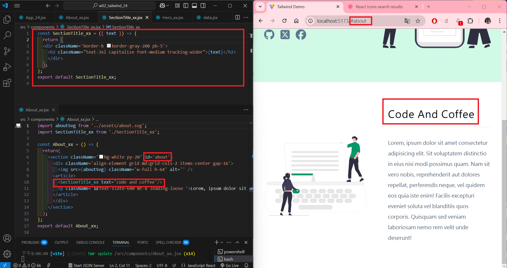
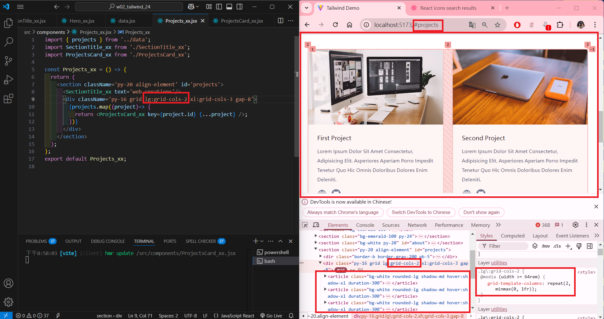
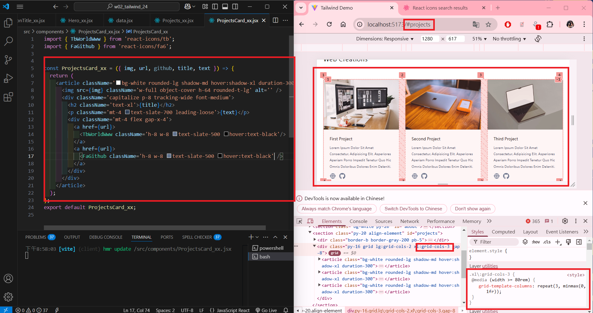
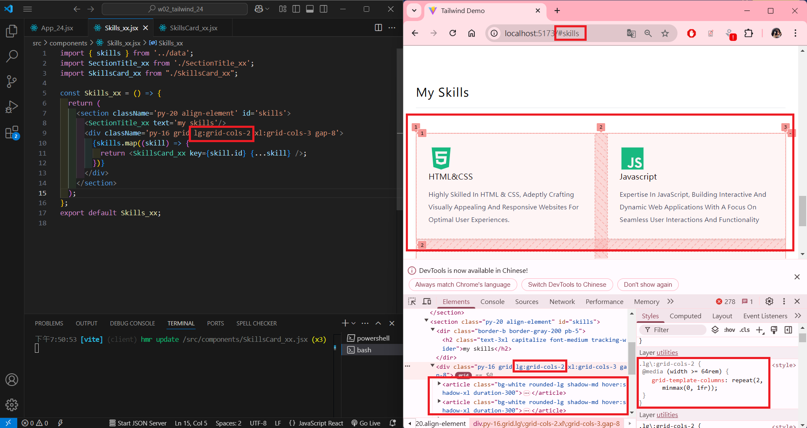
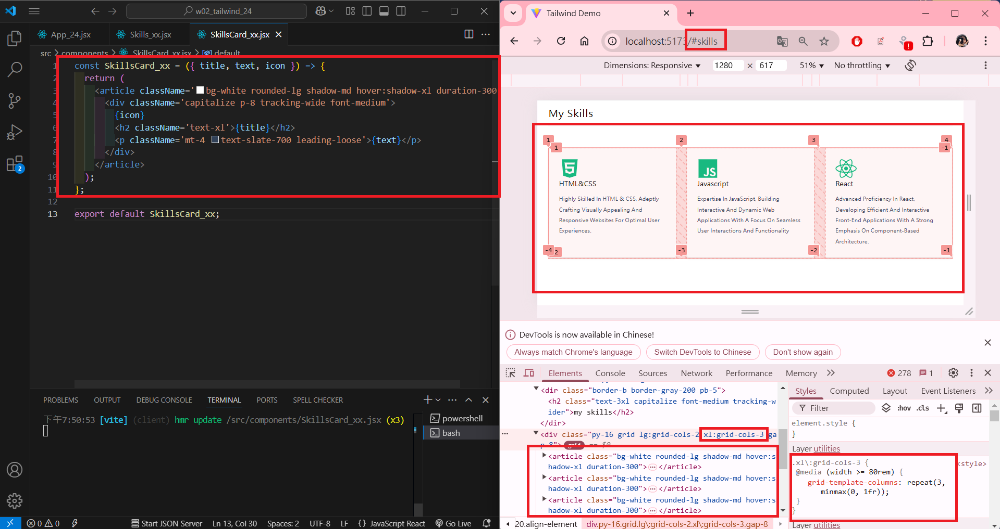
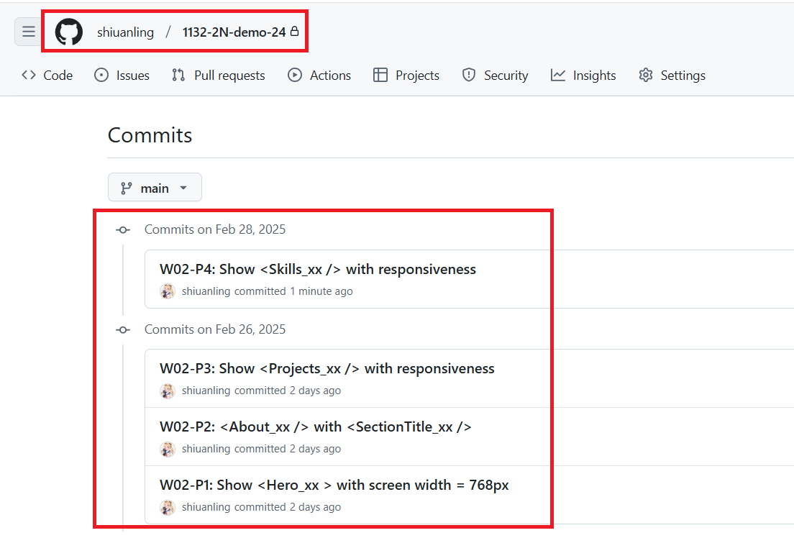

[My GitHub URL](https://github.com/shiuanling/1132-2N-demo-24.git)

### W02-P1: Show <Hero_xx > with screen width = 768px

```
924a11c shiuanling      Wed Feb 26 19:28:16 2025 +0800  W02-P1: Show <Hero_xx > with screen width = 768px
```

### W02-P2: <About_xx /> with <SectionTitle_xx />

```
fae00af shiuanling      Wed Feb 26 20:12:28 2025 +0800  W02-P2: <About_xx /> with <SectionTitle_xx />
```

### W02-P3: Show <Projects_xx /> with responsiveness
 
#### => two projects in a row
 

 
#### => three projects in a row
 


### W02-P4: Show <Skills_xx /> with responsiveness 
 
#### => two sills in a row
 

 
#### => three skills in a row
 


### W02-P5: W02 git logs


git log --pretty=format:"%h%x09%an%x09%ad%x09%s" --after="2024-02-25"