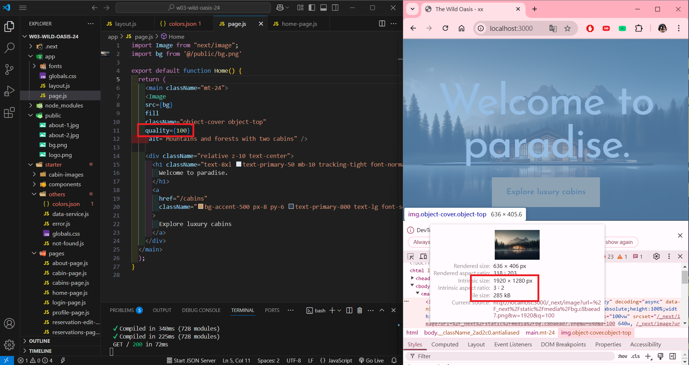
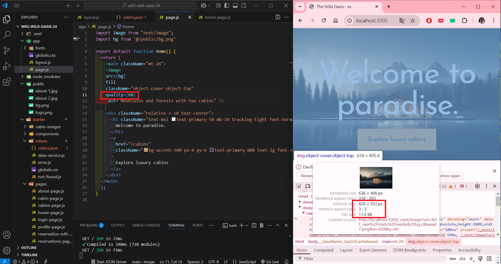
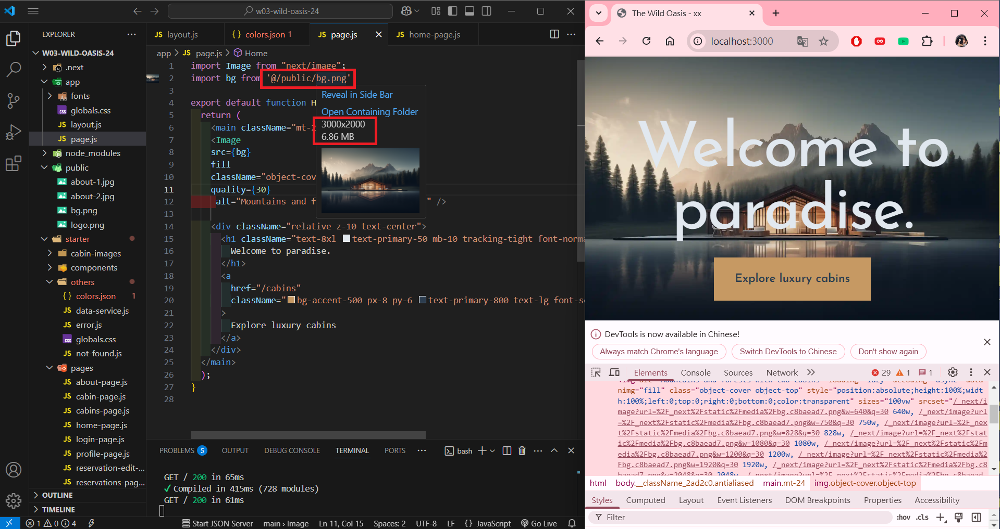
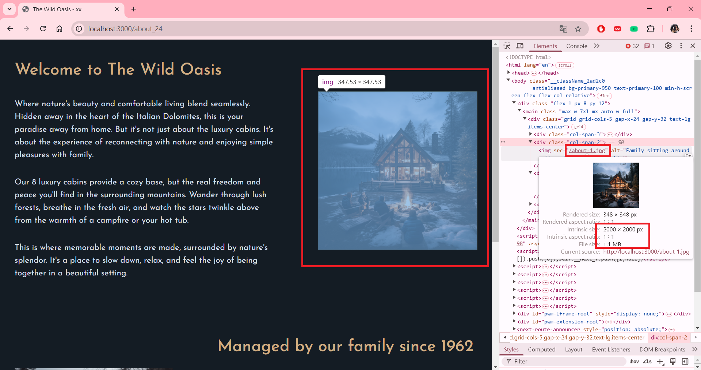
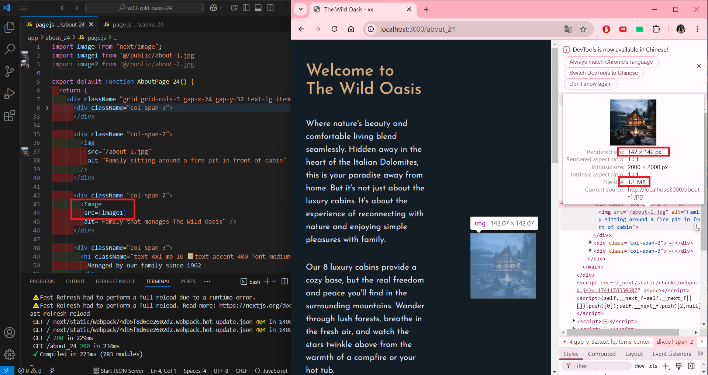
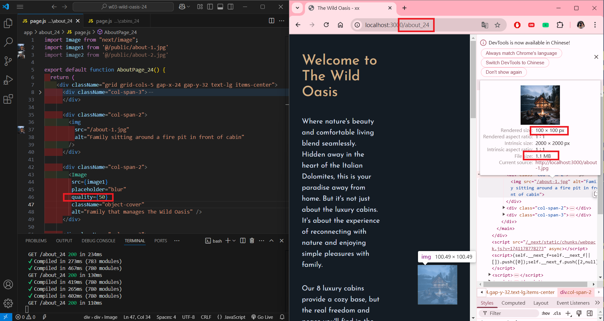
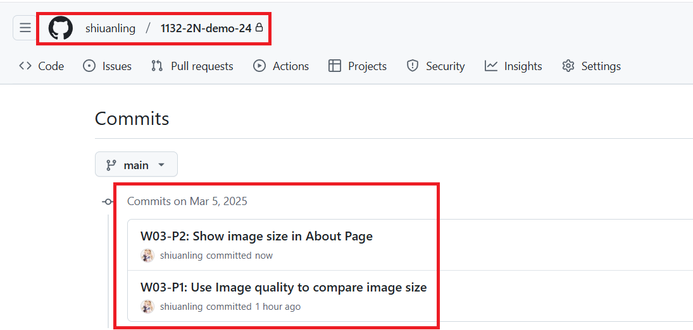

[My GitHub URL](https://github.com/shiuanling/1132-2N-demo-24.git)

### W03-P1: Use Image quality to compare image size
 
#### => quality=100, image size = 285KB
 

 
#### => quality=60, , image size = 11.6KB
 

 
#### => original image size, size = 6.86 MB
 

```
f2c533c shiuanling      Wed Mar 5 20:00:51 2025 +0800   W03-P1: Use Image quality to compare image size
```

### W03-P2: Show image size in About Page
 
#### => original image size, size = 1.1 MB
 

 
#### => use Image to optimize the image
 

 
#### => use Image with quality=50
 

```
4460ca6 shiuanling      Wed Mar 5 21:03:03 2025 +0800   W03-P2: Show image size in About Page
```

### W03-P3: W03 git logs



git log --pretty=format:"%h%x09%an%x09%ad%x09%s" --after="2025-03-04"