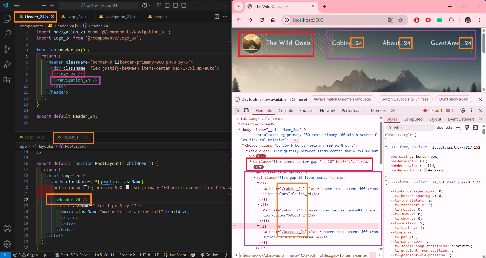
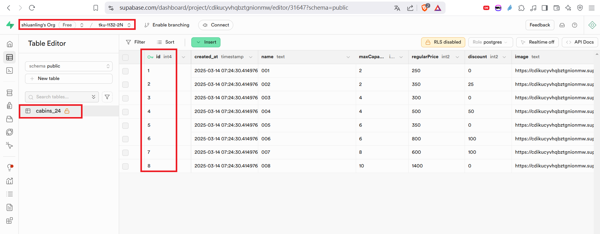
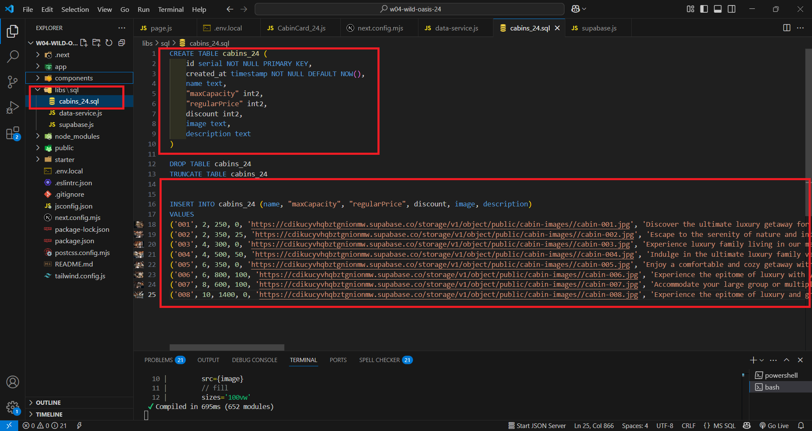
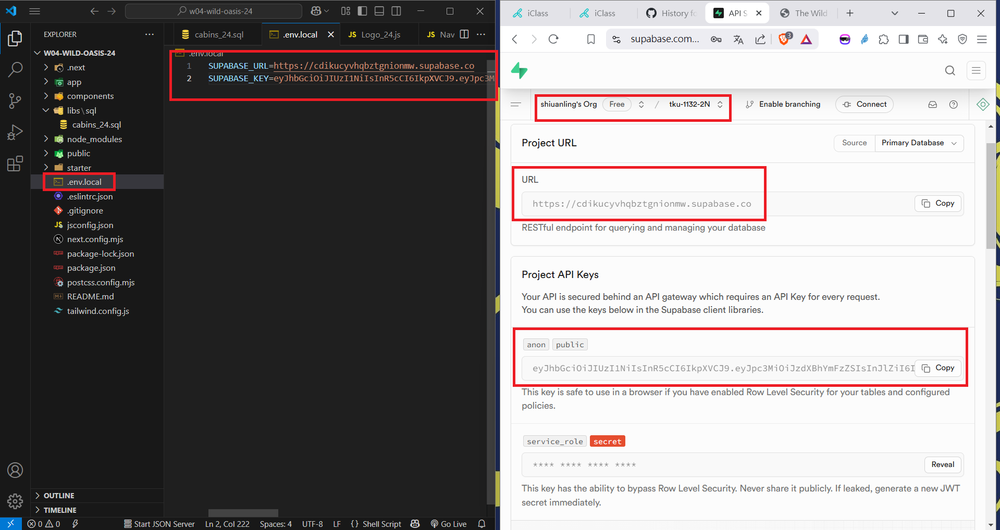
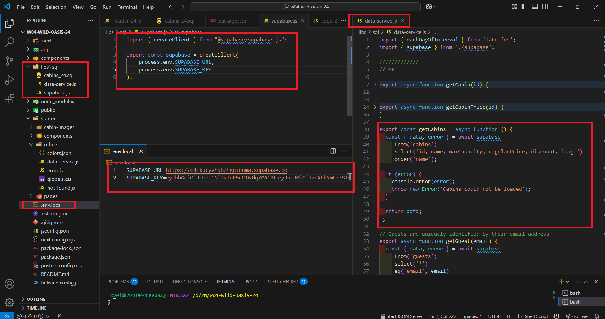
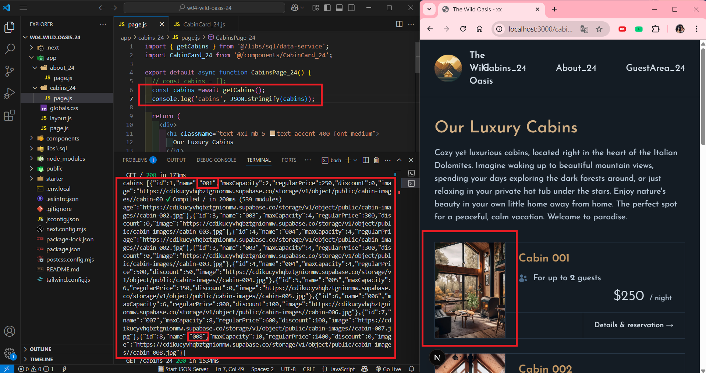
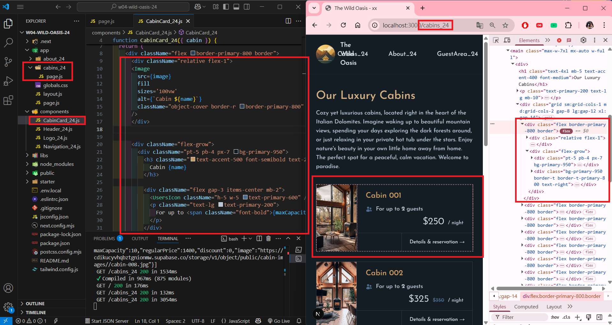
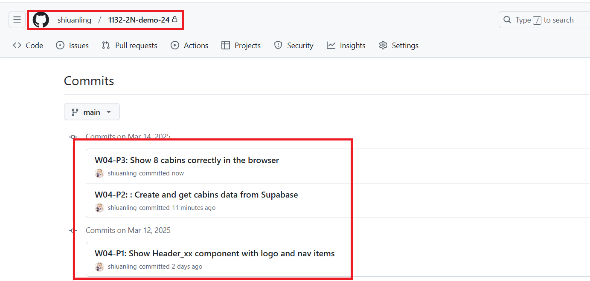

[My GitHub URL](https://github.com/shiuanling/1132-2N-demo-24.git)

### W04-P1: Show Header_xx component with logo and nav items

```
ff606c5 shiuanling      Wed Mar 12 19:02:59 2025 +0800  W04-P1: Show Header_xx component with logo and nav items
```

### W04-P2: : Create and get cabins data from Supabase
 
#### => setup cabins_xx table (8 data)
 

 
#### => sql command to create and insert data
 

 
#### => show how to get Supabase URL and key
 

 
### => show how to use Supabase client to get cabins data
 

 
### => show cabins data in server console
 

```
8a0859f shiuanling      Fri Mar 14 17:21:42 2025 +0800  W04-P2: : Create and get cabins data from Supabase
```

### W04-P3: Show 8 cabins correctly in the browser

```
180343d shiuanling      Fri Mar 14 17:32:01 2025 +0800  W04-P3: Show 8 cabins correctly in the browser
```

### W04-P4: W04 git logs

```
7b9356c shiuanling      Fri Mar 14 17:33:52 2025 +0800  W04-P4: W04 git logs
180343d shiuanling      Fri Mar 14 17:32:01 2025 +0800  W04-P3: Show 8 cabins correctly in the browser
8a0859f shiuanling      Fri Mar 14 17:21:42 2025 +0800  W04-P2: : Create and get cabins data from Supabase
ff606c5 shiuanling      Wed Mar 12 19:02:59 2025 +0800  W04-P1: Show Header_xx component with logo and nav items
```