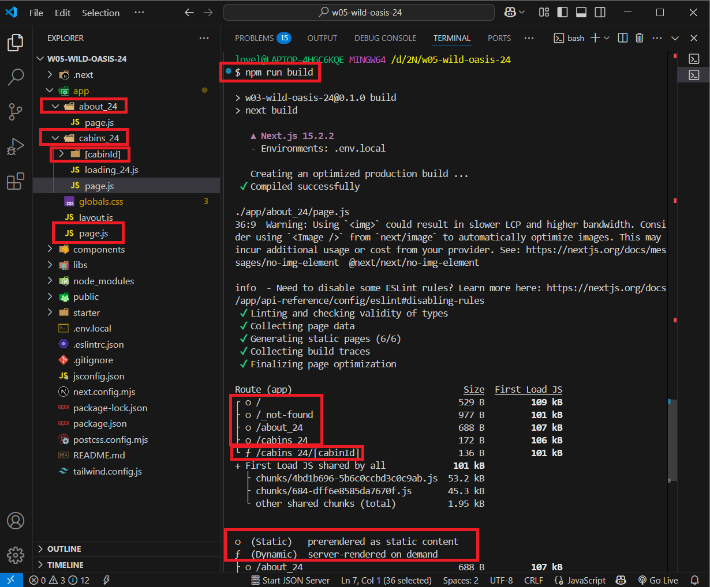
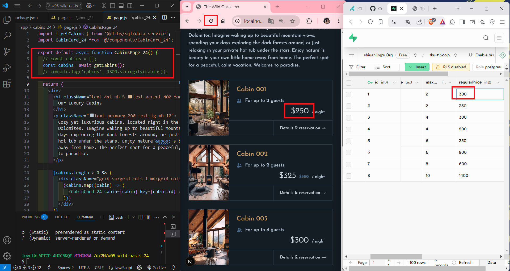
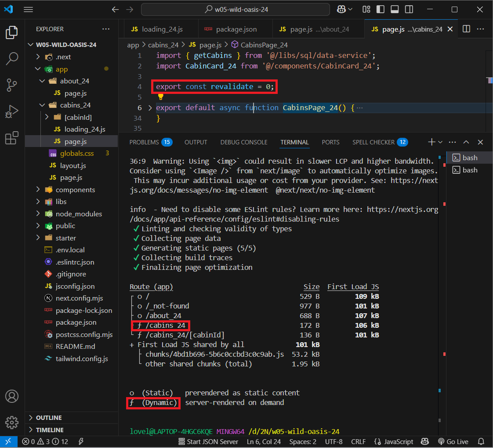
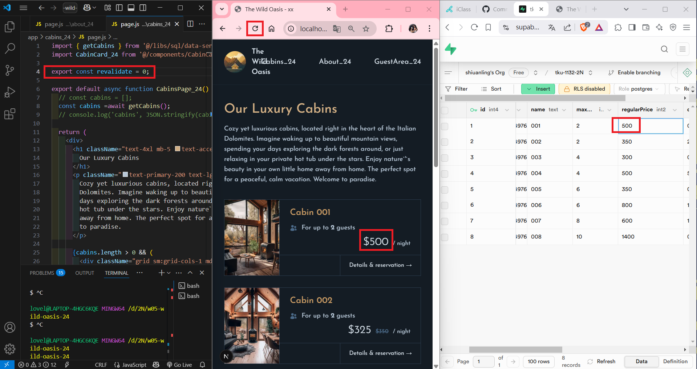

[My GitHub URL](https://github.com/shiuanling/1132-2N-demo-24.git)

### W05-P1: use route /cabins_xx to show static rending and dynamic rendering
 
#### => Show route /cabins_xx as static route by using "npm run build" command
 

 
#### => change the price of cabin 1 in Supabase from 250 to 300, and refresh page, nothing change
 

 
#### => Show route /cabins_xx as dynamic route by using "npm run build" command
 

 
#### => change the price of cabin 1 in Supabase from 300 to 500, and refresh page, price does change
 

### W05-P2:

### W05-P3:

### W05-P4: W05 git logs

git log --pretty=format:"%h%x09%an%x09%ad%x09%s" --after="2025-03-18"