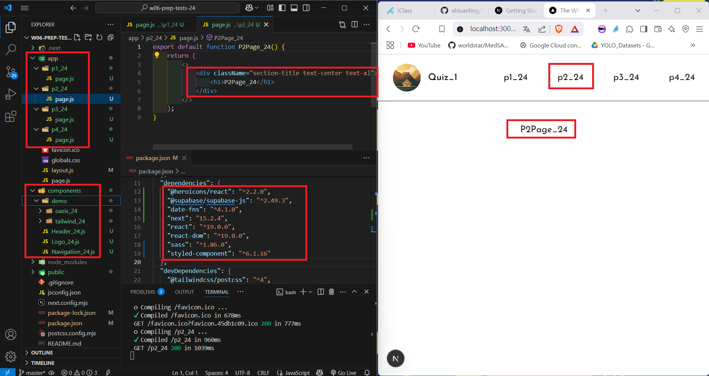
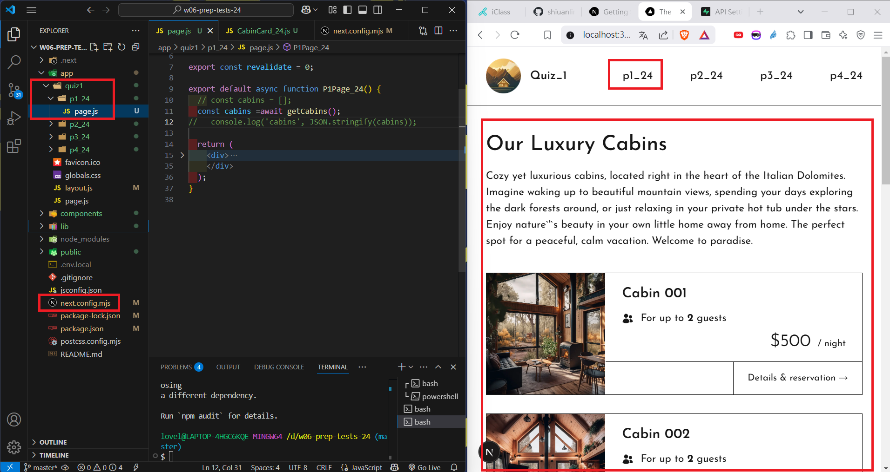
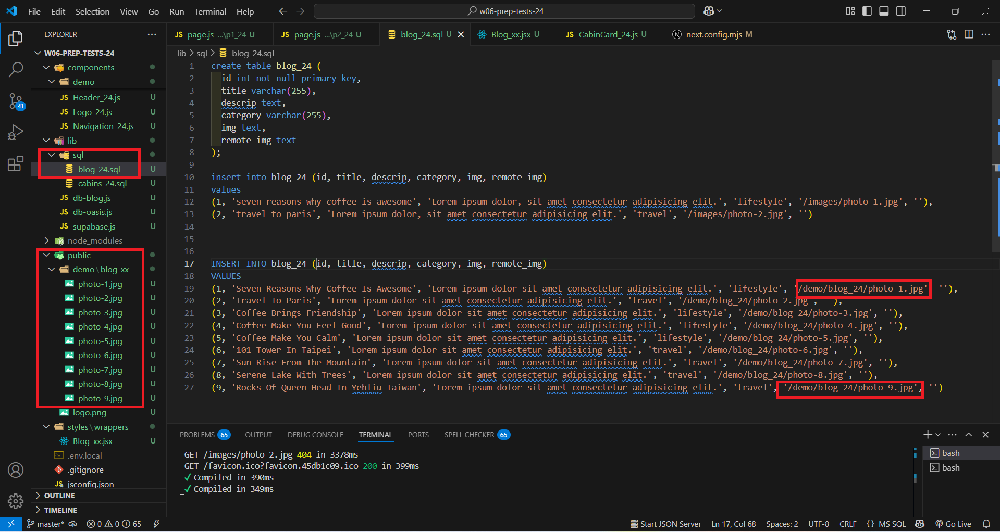
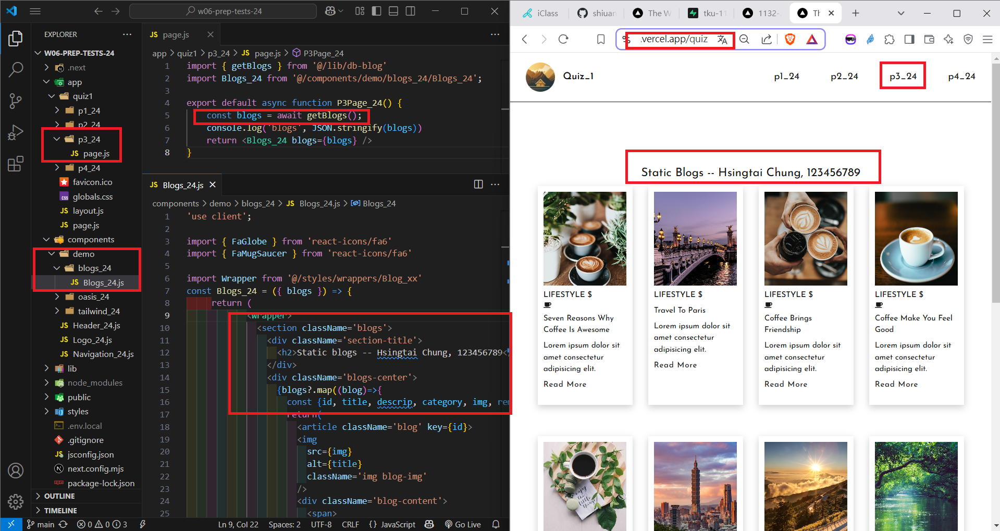
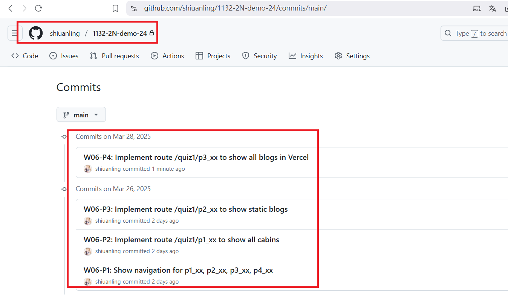

[My GitHub URL](https://github.com/shiuanling/1132-2N-demo-24.git)

### W06-P1: Show navigation for p1_xx, p2_xx, p3_xx, p4_xx

```
30e3464 shiuanling      Wed Mar 26 19:41:13 2025 +0800  W06-P1: Show navigation for p1_xx, p2_xx, p3_xx, p4_xx
```

### W06-P2: Implement route /quiz1/p1_xx to show all cabins

```
c61c42b shiuanling      Wed Mar 26 20:43:57 2025 +0800  W06-P2: Implement route /quiz1/p1_xx to show all cabins
```

### W06-P3: Implement route /quiz1/p2_xx to show static blogs
 
#### => show static blogs
 

 
#### => show blog_xx.sql with img pointing to /demo/blog_xx directory
 

```
8794379 shiuanling      Wed Mar 26 21:12:08 2025 +0800  W06-P3: Implement route /quiz1/p2_xx to show static blogs
```

### W06-P4: Implement route /quiz1/p3_xx to show all blogs in Vercel

```
69e0281 shiuanling      Fri Mar 28 15:34:58 2025 +0800  W06-P4: Implement route /quiz1/p3_xx to show all blogs in Vercel
```
### W06-P5: W06 git logs

```
6f38424 shiuanling      Fri Mar 28 15:37:07 2025 +0800  W06-P5: W06 git logs
69e0281 shiuanling      Fri Mar 28 15:34:58 2025 +0800  W06-P4: Implement route /quiz1/p3_xx to show all blogs in Vercel
8794379 shiuanling      Wed Mar 26 21:12:08 2025 +0800  W06-P3: Implement route /quiz1/p2_xx to show static blogs
c61c42b shiuanling      Wed Mar 26 20:43:57 2025 +0800  W06-P2: Implement route /quiz1/p1_xx to show all cabins
30e3464 shiuanling      Wed Mar 26 19:41:13 2025 +0800  W06-P1: Show navigation for p1_xx, p2_xx, p3_xx, p4_xx
```