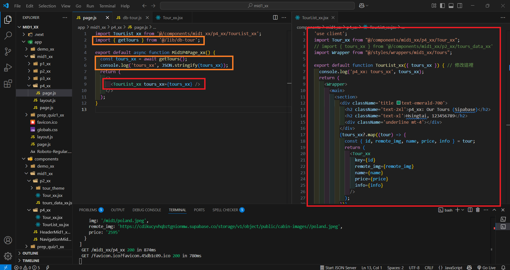
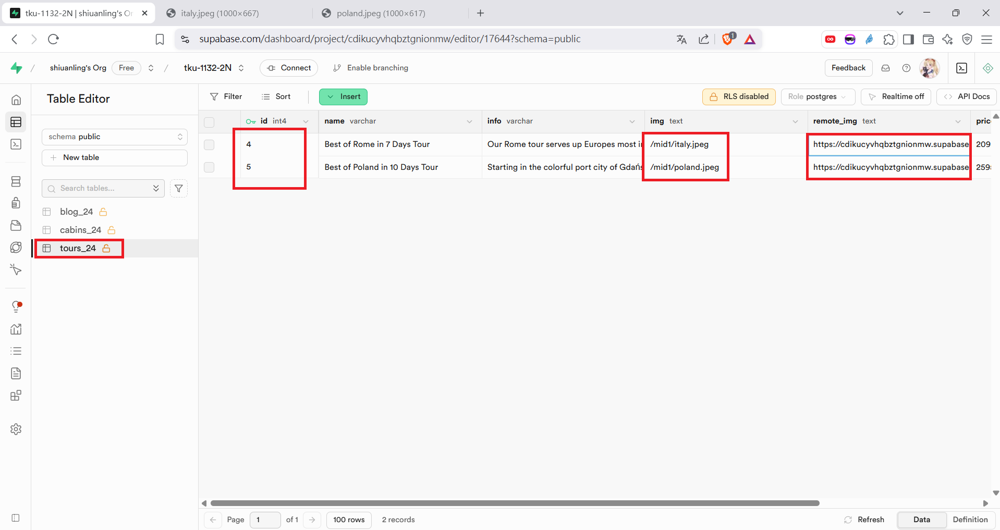
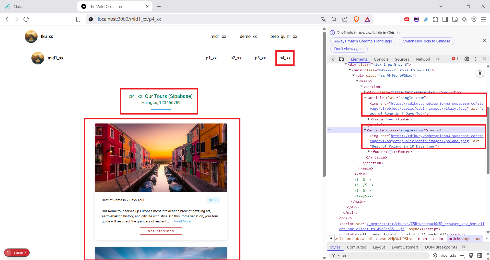
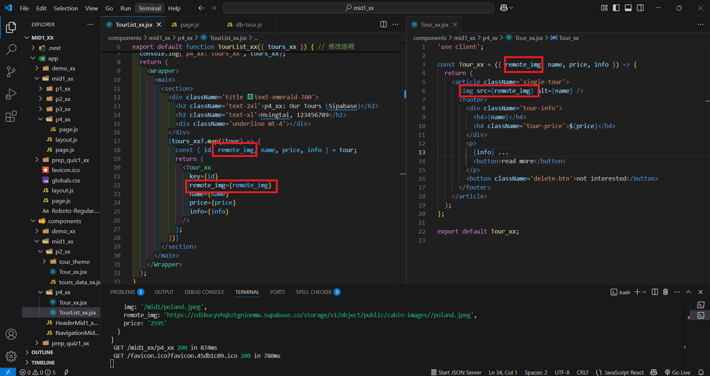
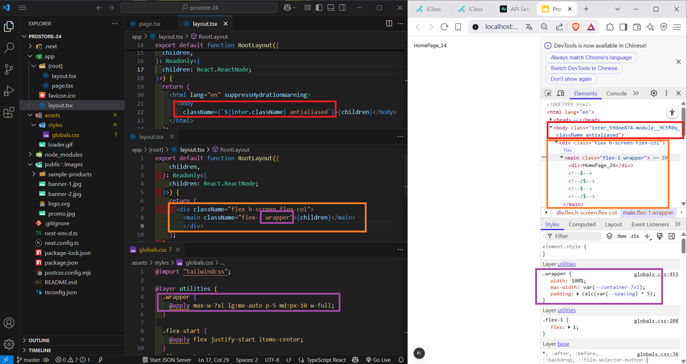
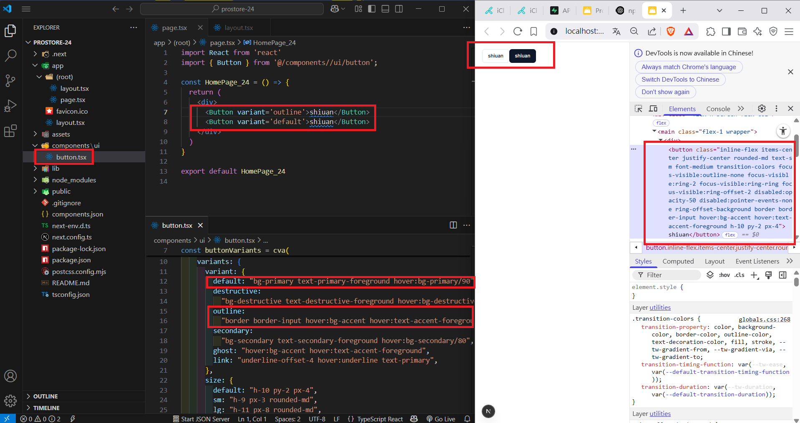
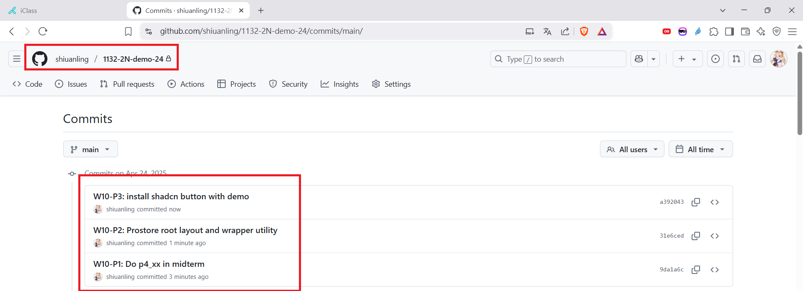

[My GitHub URL](https://github.com/shiuanling/1132-2N-demo-24.git)

### W10-P1: Do p4_xx in midterm
 
#### => p4_xx/page.jsx and TourList_xx component
 

 
#### => Supabase with 3 tours as described in the midterm exam
 

 
#### => Get 3 tour images from Supabase storage
 

 
#### => show the code of how to get remote image from Supabase storage
 


```
9da1a6c shiuanling      Thu Apr 24 15:52:32 2025 +0800  W10-P1: Do p4_xx in midterm
```
### W10-P2: Prostore root layout and wrapper utility


### W10-P3: install shadcn button with demo


### W10-P4: W10 git logs


git log --pretty=format:"%h%x09%an%x09%ad%x09%s" --after="2025-04-22"