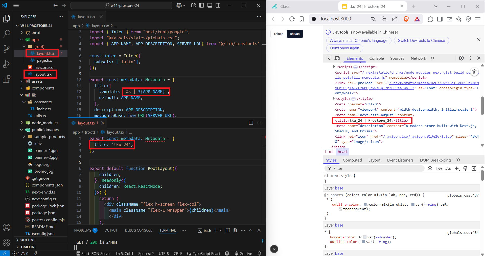
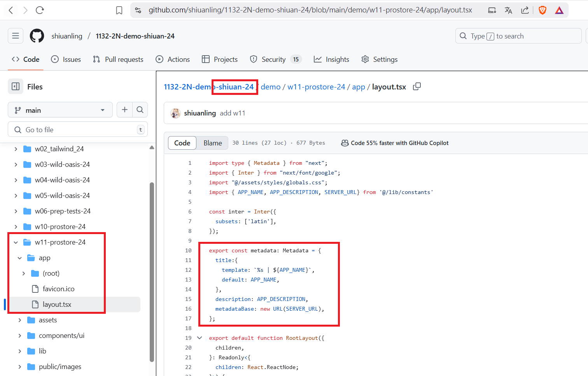

[My GitHub URL](https://github.com/shiuanling/1132-2N-demo-24.git)

### W11-P1: : Manage metadata, git push w11 code
 
#### => setup constants and metadata template
 

 
#### => git push demo/w11_prostore_xx code, and change repo name by adding your name
 

```
df4c65e shiuanling      Wed Apr 30 19:23:43 2025 +0800  W11-P1: : Manage metadata, git push w11 code
```

### W11-P2: Implement Header_xx and can change themes

```
83035e3 shiuanling      Wed Apr 30 21:02:46 2025 +0800  W11-P2: Implement Header_xx and can change themes
```

### W11-P3: W11 git logs


git log --pretty=format:"%h%x09%an%x09%ad%x09%s" --after="2025-04-29"