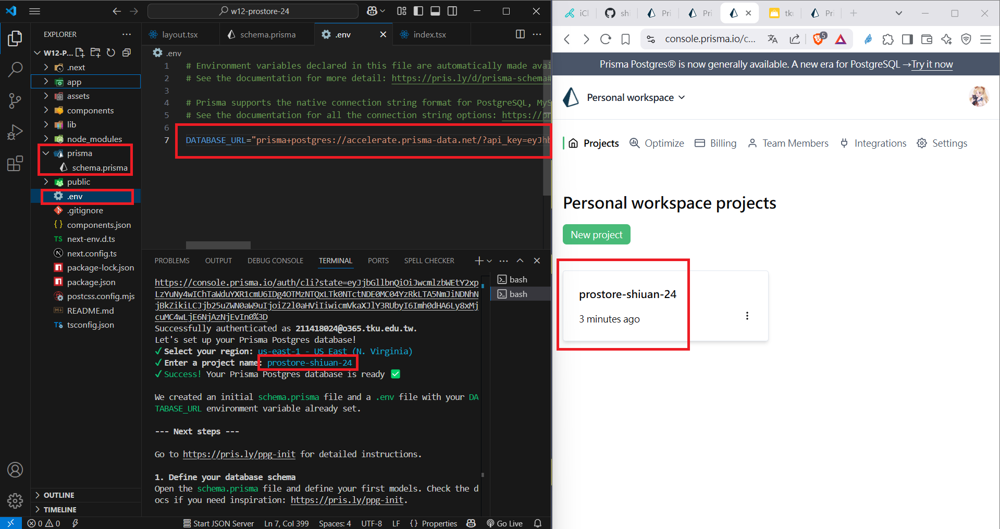
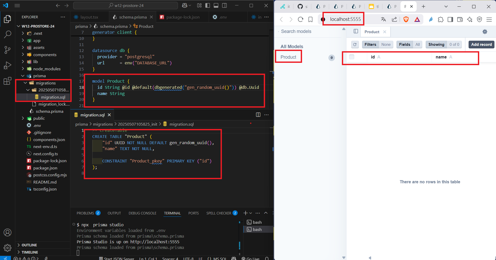
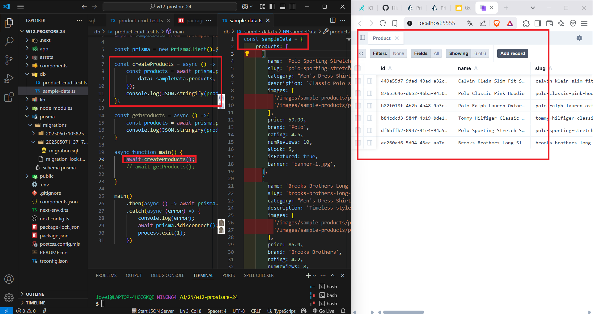
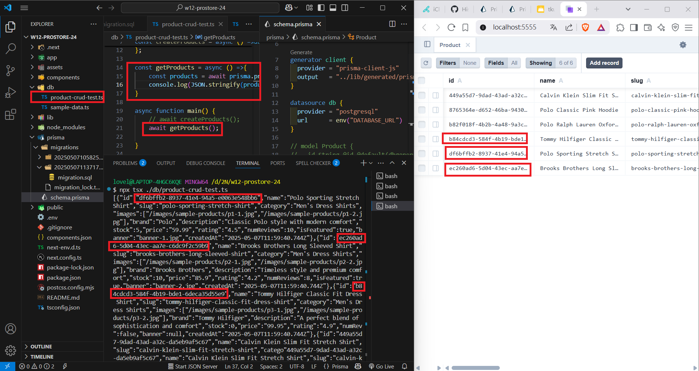
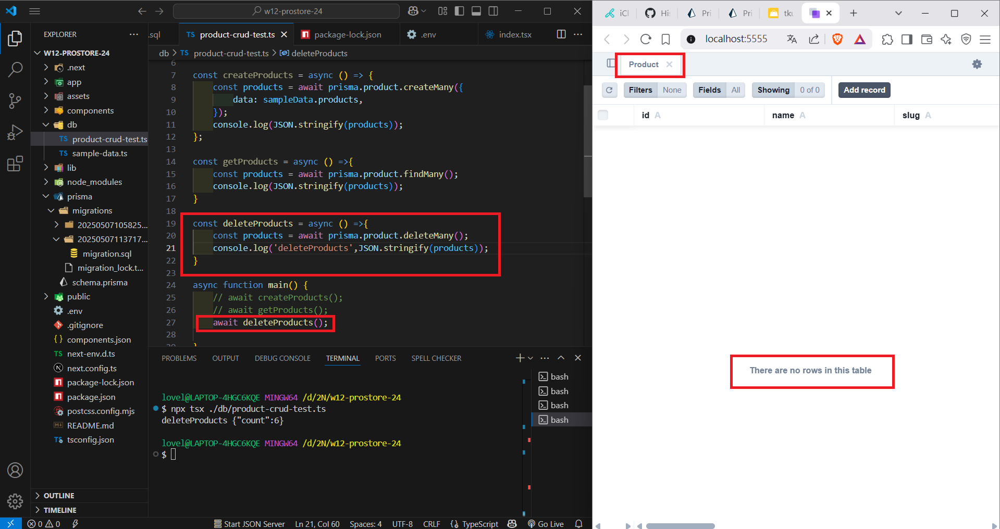
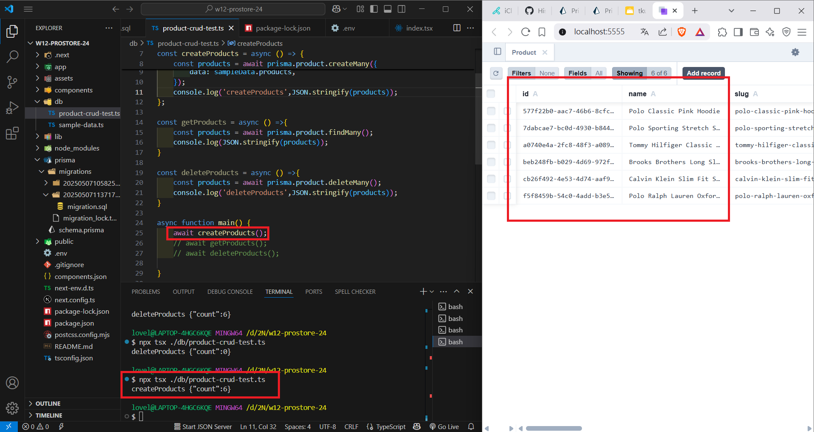
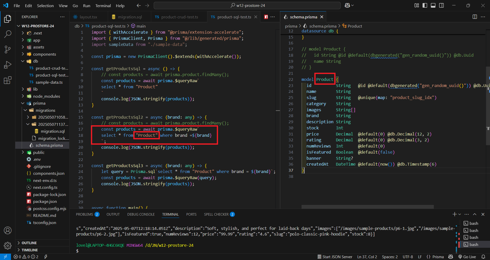
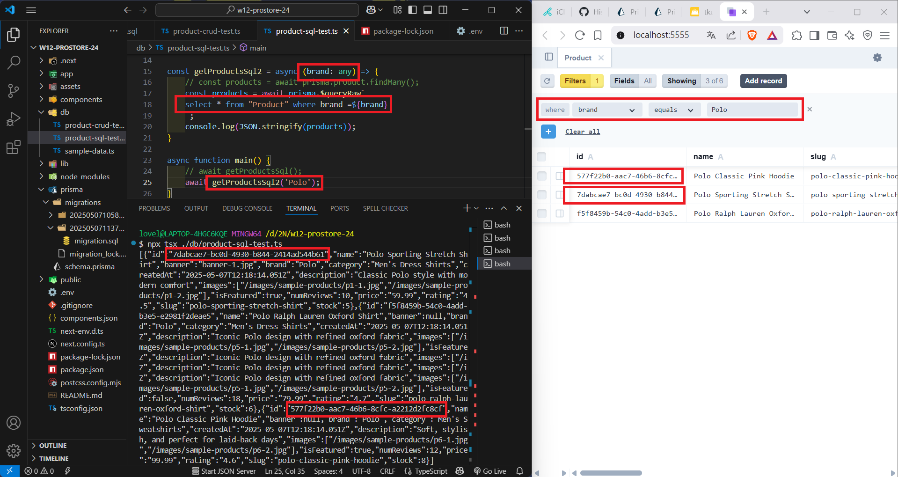
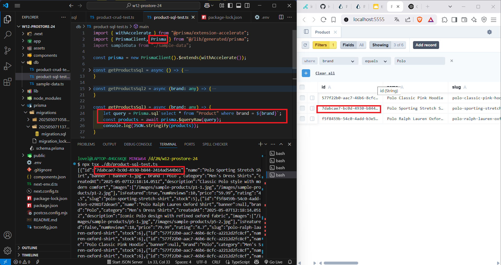
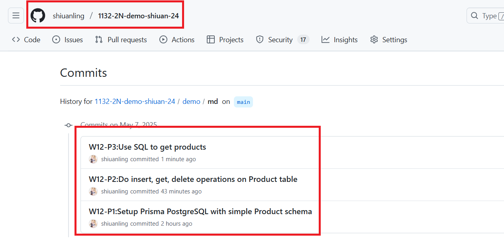

[My GitHub URL](https://github.com/shiuanling/1132-2N-demo-24.git)

### W12-P1:Setup Prisma PostgreSQL with simple Product schema
 
#### => npx prisma init --db
 

 
#### => npx prisma migrate dev --name init
 

```
90b2adb shiuanling      Wed May 7 19:10:24 2025 +0800   W12-P1:Setup Prisma PostgreSQL with simple Product schema
```

### W12-P2:Do insert, get, delete operations on Product table
 
#### => create data from sample-data.ts
 

 
#### => get all products from Product table
 

 
#### => delete all products from Product table
 

 
#### => create data from sample-data.ts again
 

```
cdfd097 shiuanling      Wed May 7 20:25:18 2025 +0800   W12-P2:Do insert, get, delete operations on Product table
```

### W12-P3:Use SQL to get products
 
#### => get all products
 

 
#### => get products with brand 'Polo'
 

 
#### => show how to use $queryRaw(query)
 


### W12-P4: W12 git logs


git log --pretty=format:"%h%x09%an%x09%ad%x09%s" --after="2025-05-06"