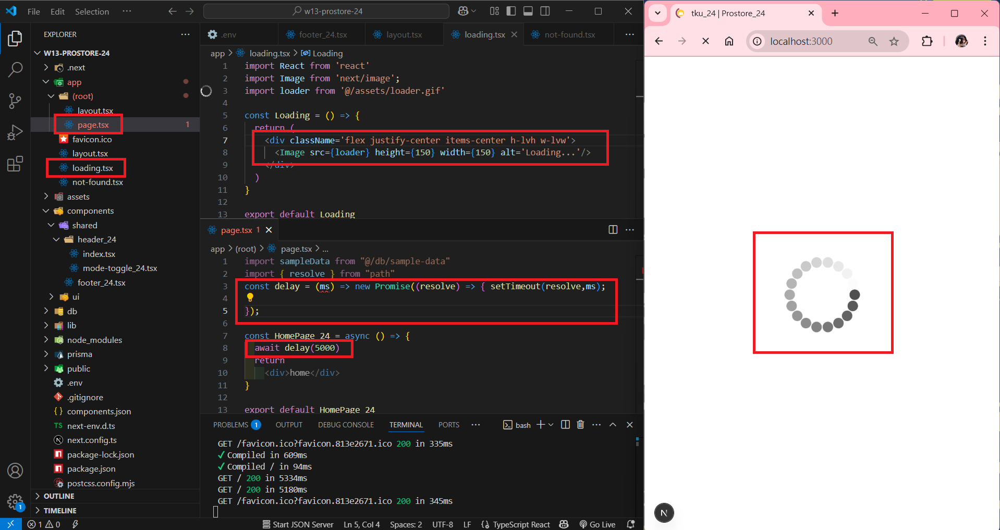
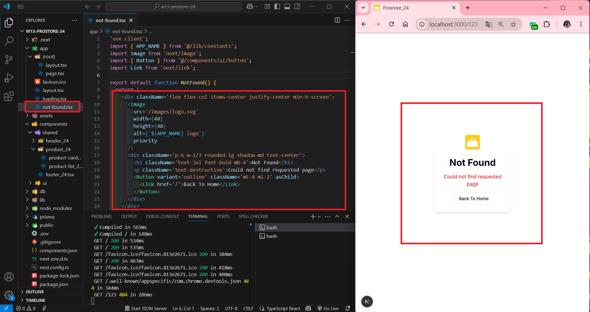

[My GitHub URL](https://github.com/shiuanling/1132-2N-demo-24.git)

### W13-P1: Create global loading page

```
15ac33c shiuanling      Wed May 14 19:55:08 2025 +0800  W13-P1: Create global loading page
```

### W13-P2: Create global not-found page

```
d517101 shiuanling      Wed May 14 20:13:45 2025 +0800  W13-P2: Create global not-found page
```

### W13-P3: Get Latest Product in Home Page
 
#### => get latest products from Database
 

 
#### => product.actions_xx.ts code is mainly from product-crud_xx.tsx
 

```
c2d482a shiuanling      Wed May 14 21:12:17 2025 +0800  W13-P3: Get Latest Product in Home Page
```

### W13-P4: W13 git logs

```
7218e05 shiuanling      Wed May 14 21:14:09 2025 +0800  W13-P4: W13 git logs
c2d482a shiuanling      Wed May 14 21:12:17 2025 +0800  W13-P3: Get Latest Product in Home Page
d517101 shiuanling      Wed May 14 20:13:45 2025 +0800  W13-P2: Create global not-found page
15ac33c shiuanling      Wed May 14 19:55:08 2025 +0800  W13-P1: Create global loading page
```