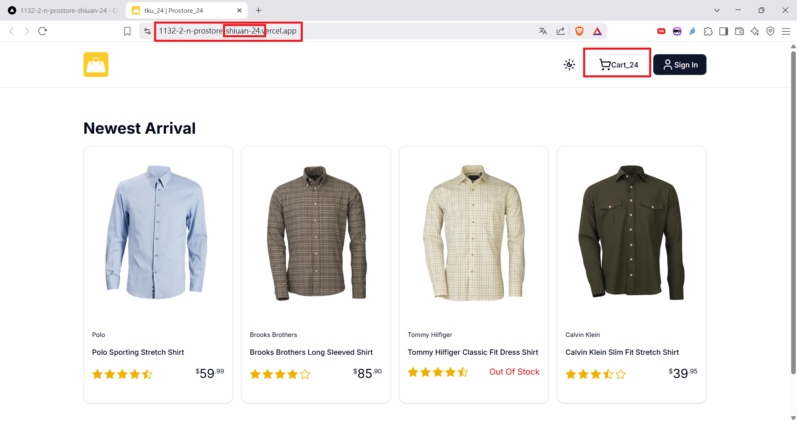
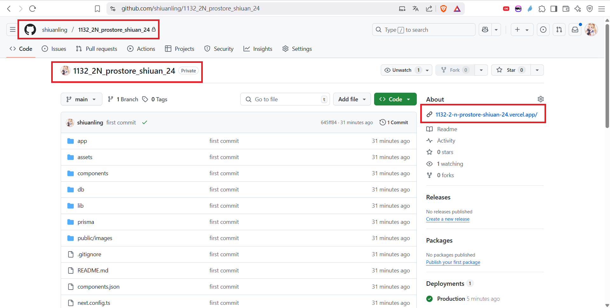
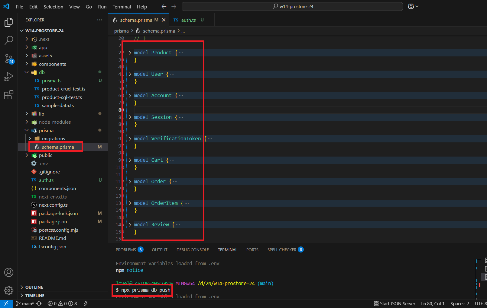
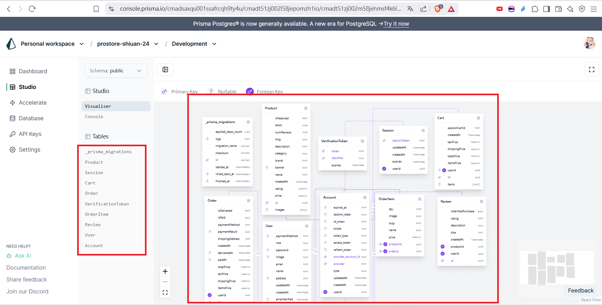
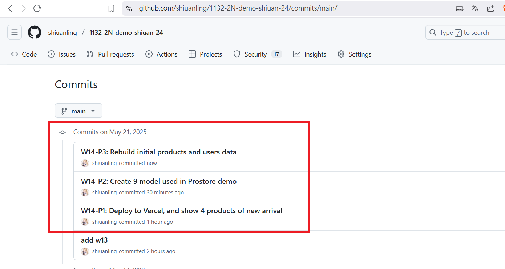

[My GitHub URL](https://github.com/shiuanling/1132-2N-demo-24.git)

### W14-P1: Deploy to Vercel, and show 4 products of new arrival
 
#### => Vercel demo
 

 
#### => Github repo and the Vercel link
 

```
fd625dc shiuanling      Wed May 21 19:45:19 2025 +0800  W14-P1: Deploy to Vercel, and show 4 products of new arrival
```

### W14-P2: Create 9 model used in Prostore demo
 
#### => use prisma db push to update schema
 

 
#### => use Studio to visualize 9 models
 


### W14-P3:


### W14-P4: W14 git logs


git log --pretty=format:"%h%x09%an%x09%ad%x09%s" --after="2025-05-20"