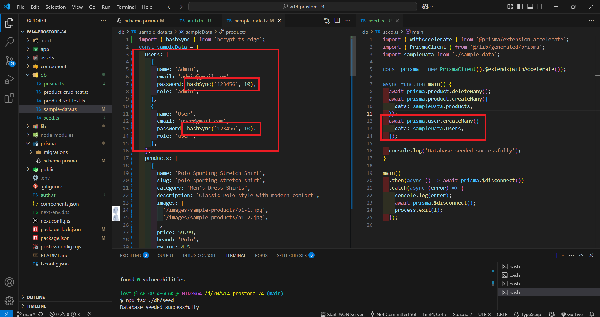
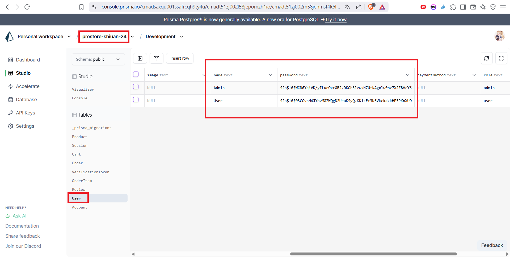

[My GitHub URL](https://github.com/shiuanling/1132-2N-demo-24.git)

### W14-P1: Deploy to Vercel, and show 4 products of new arrival
 
#### => Vercel demo
 

 
#### => Github repo and the Vercel link
 

```
fd625dc shiuanling      Wed May 21 19:45:19 2025 +0800  W14-P1: Deploy to Vercel, and show 4 products of new arrival
```

### W14-P2: Create 9 model used in Prostore demo
 
#### => use prisma db push to update schema
 

 
#### => use Studio to visualize 9 models
 

```
7a9d943 shiuanling      Wed May 21 20:34:46 2025 +0800  W14-P2: Create 9 model used in Prostore demo
```

### W14-P3: Rebuild initial products and users data
 
#### => show the code
 

 
#### => show in Studio
 

```
d9a7b6a shiuanling      Wed May 21 21:04:53 2025 +0800  W14-P3: Rebuild initial products and users data
```

### W14-P4: W14 git logs

```
c5213c5 shiuanling      Wed May 21 21:06:36 2025 +0800  W14-P4: W14 git logs
d9a7b6a shiuanling      Wed May 21 21:04:53 2025 +0800  W14-P3: Rebuild initial products and users data
7a9d943 shiuanling      Wed May 21 20:34:46 2025 +0800  W14-P2: Create 9 model used in Prostore demo
fd625dc shiuanling      Wed May 21 19:45:19 2025 +0800  W14-P1: Deploy to Vercel, and show 4 products of new arrival
2c90c47 shiuanling      Wed May 21 18:26:06 2025 +0800  add w13
```