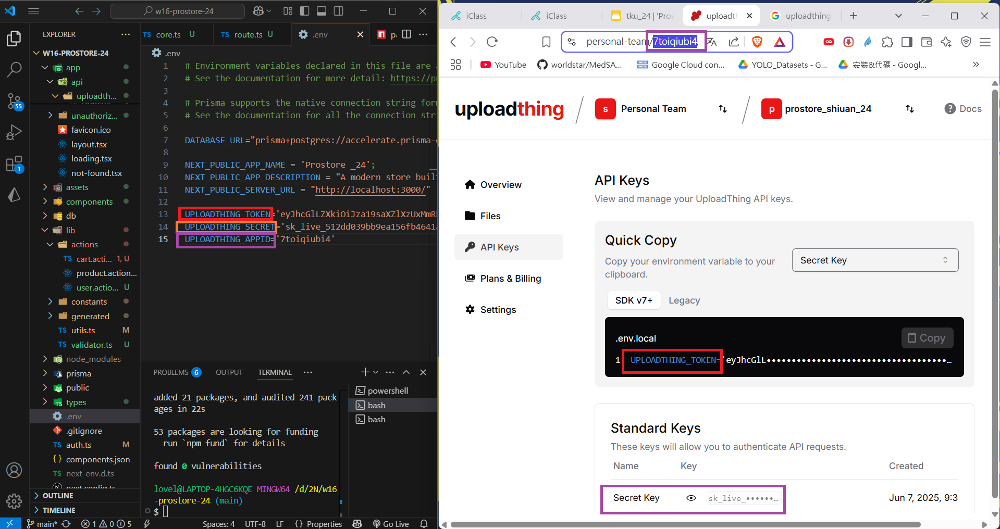
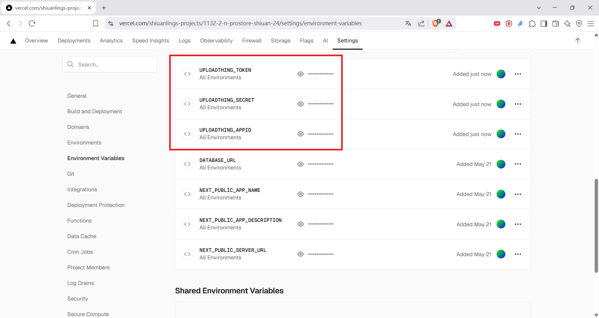
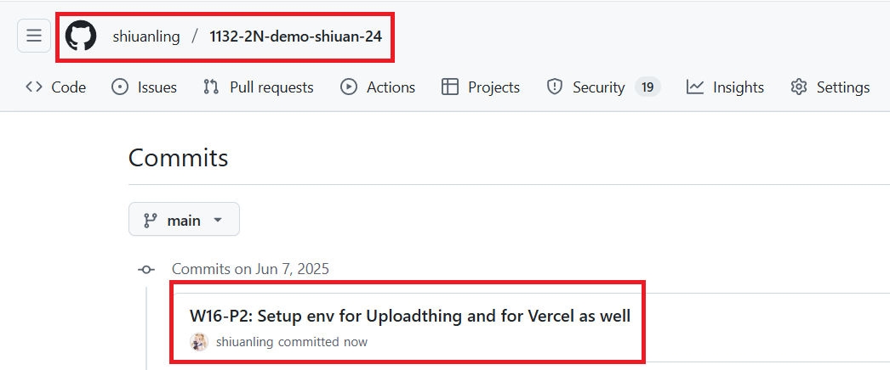

[My GitHub URL](https://github.com/shiuanling/1132-2N-demo-24.git)

### W16-P1: Create a page for a single product using slug


### W16-P2: Setup env for Uploadthing and for Vercel as well
 
#### => setup three environment variables in .env
 

 
#### => setup three environment variables in Vercel
 

```
96fabb4 shiuanling      Sat Jun 7 21:53:32 2025 +0800   W16-P2: Setup env for Uploadthing and for Vercel as well
```

### W16-P3: W16 git logs


git log --pretty=format:"%h%x09%an%x09%ad%x09%s" --after="2025-06-06"